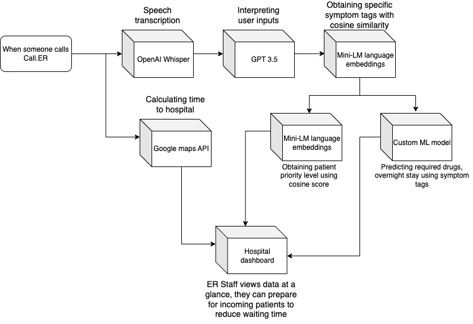
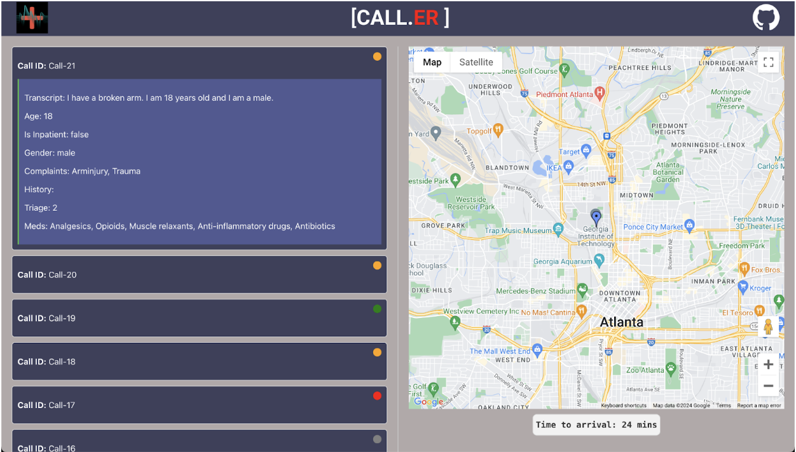
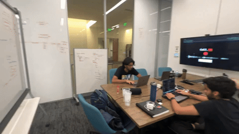

# EROptimizer

A novel AI solution that reduced ER wait times by predicting the required drugs, priority level, and overnight admission status.

## The Problem
**The average wait time for the ER in the U.S. is approximately two hours and 25 minutes**

This is a shocking metric and in the words of Stacey Judson, an ER trauma nurse, “it's hard to imagine waiting that long to be admitted to the ER, but it's a reality many Americans face.” 

We realized that there is an alarming inefficiency in current emergency communication. Having an instantaneous solution that runs on existing emergency infrastructure would undoubtedly save lives.

Hospitals are understaffed and ill-prepared for the volume of patients they see on a daily basis. On top of this, 911 operators have been forced to leave **critically injured patients** on hold for extended periods due to the volume of calls.

Hospitals currently rely on human communication and planning. They rarely receive important variables like estimated time of arrival, medicines needed, and triage level until a patient arrives at the ER.

Call.ER leverages a suite of AI tools, from class machine learning to word embeddings to GPT 3.5 to infer relevant patient information from an emergency phone call.



## Challenges
We ran into so many bugs we thought we might need a pest control team instead of a development team! However, we worked through each one patiently and are proud to show off everything we learned in the process.

- **Speech Transcription**:
Ran into an issue when prompting users with audio
   - The fix: implemented silence detection to finish transcription 
- **Classic ML**:
Along with using LLMs and Embeddings, we trained our own model to predict which drugs would be needed based on the symptoms, medical history, and age of the patient.
This model tended to underfit because input and output data was sparse.
   - The fix: Implemented batch normalization, learning rate decay, loss metric based on dice coefficient, custom model architecture
- **LLM Interface**:
Issues with limited OpenAI credit and incorrect output from GPT
   - The fix: we tweaked the prompt extensively to get the desired output and reduced our API calls by training our own model.
- **Sentence Transformer Embeddings**:
Here our main issue was with getting words to fit into the tags given in our dataset
   - The fix: we tuned thresholds to ensure that the correct words were being fitted to the correct tags
- **Output Variables**:
Since we were making so many inferences based on a lot of different inputs and outputs, we ran into issues with getting every output into the correct form and on the webpage
   - The fixes: reimplementing word similarity to ensure that the correct words are appearing on the webpage based on our transcription processing
- **Front End**:
CORS permission issues, maintaining a consistent state between different views
   - The fixes: changed the host and reset CORS, implemented flask features to route backend API calls

Lastly, we ran into the occasional merge conflict. We tried our best to ensure we all worked in similar git environments and maintained a clean working tree.


## Getting Started

Follow these steps to set up and run the project:

### Prerequisites

- Python 3.x
- npm (Node.js package manager)
- ffmpeg

### Installation

1. **Create a Python Virtual Environment**:
   ```bash
   python3 -m venv venv
   source venv/bin/activate  # On Windows use `venv\Scripts\activate` 
   ```
2. **Install Python Dependencies**
3. **Install Node Modules:**:
    ```bash
    cd react-flask-app
    npm install
    ```
4. **Set Up Environment Variables:**
    Generate an OpenAI API key and Google Key:
    ```bash
    echo "OPENAI_API_KEY={your_openai_api_key}" > react-flask-app/api/.env
    echo "REACT_APP_GOOGLE_API_KEY={your_google_api_key}" > react-flask-app/.env
    ```
    
### Running the Application

1. **Start the app: In 2 seperate windows run**:
    ```
    npm run start-api
    npm start
    ```
    Visit 127.0.0.1:3000/client for the client interface.
    Visit 127.0.0.1:3000/server for the server interface



## Bonus gif of us at 3AM

